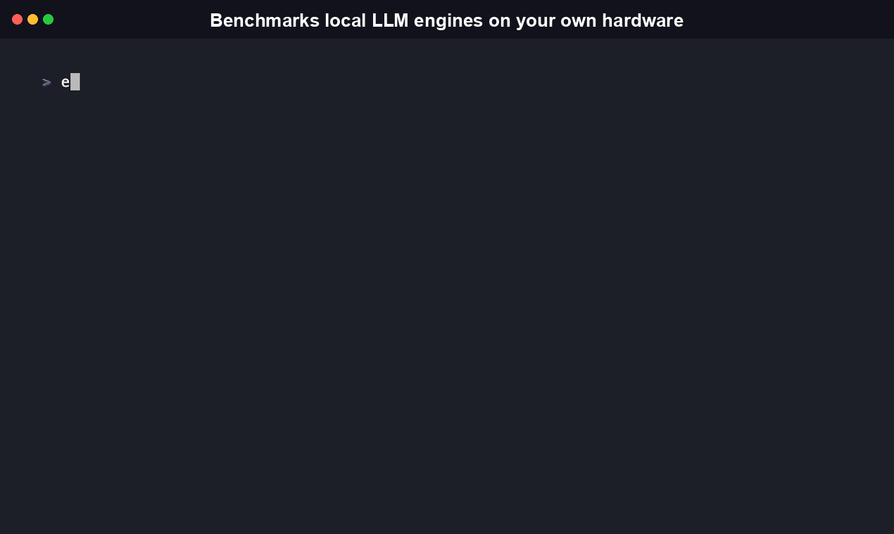
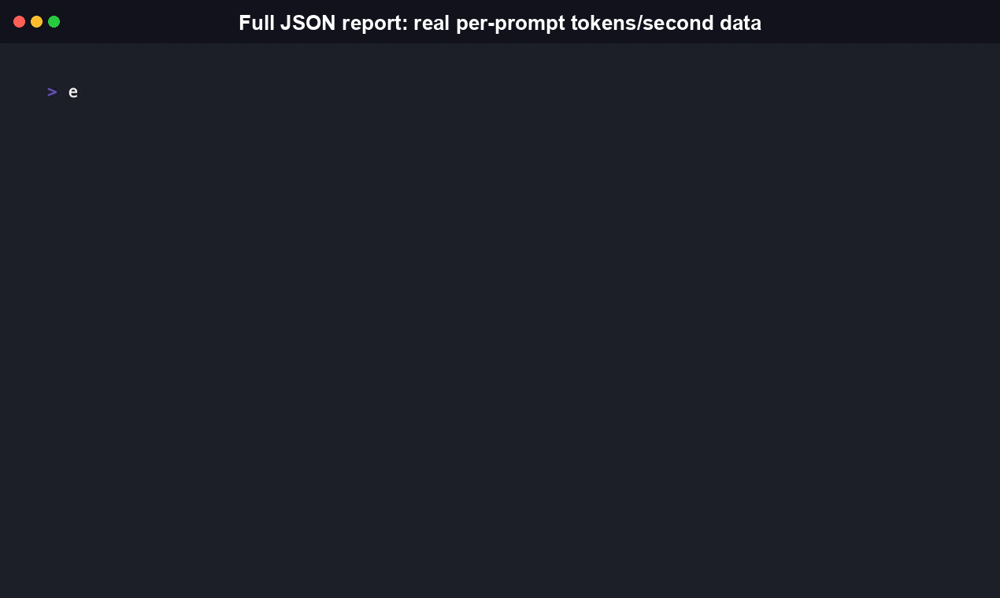

# InferBench

<!-- mcp-name: io.github.RudrenduPaul/inferbench -->

[](https://github.com/RudrenduPaul/InferBench/actions/workflows/ci.yml)
[](https://www.npmjs.com/package/inferbench-cli)
[](https://pypi.org/project/inferbench-cli/)
[](./LICENSE)

<a href="https://www.producthunt.com/products/inferbench?embed=true&utm_source=badge-featured&utm_medium=badge&utm_campaign=badge-inferbench" target="_blank" rel="noopener noreferrer"></a>

Every "best local LLM engine" article benchmarks someone else's machine. InferBench benchmarks yours.

Local-inference engines all publish their own benchmarks, on their own hardware, in their own README. None of them tell you which one is actually fastest on the machine sitting in front of you. InferBench runs a fixed, varied prompt set against whichever supported engines are installed on your own hardware and reports real, measured tokens/second -- not a number copied from someone else's blog post.

Install, first run, and a real omlx benchmark against a cached model:



```bash
npx inferbench-cli run --engines llama.cpp --model "bartowski/Qwen2.5-1.5B-Instruct-GGUF:Q4_K_M"
```

## Table of contents

- [Install](#install)
- [Features](#features)
- [Quickstart](#quickstart)
- [CLI command reference](#cli-command-reference)
- [Library API reference](#library-api-reference)
- [How the measurement works](#how-the-measurement-works)
- [Comparison](#comparison)
- [Why this exists](#why-this-exists)
- [Documentation](#documentation)
- [FAQ](#faq)
- [Contributing](#contributing)
- [Security](#security)
- [License](#license)

## Install

InferBench ships two independent, equally first-class packages -- pick
whichever fits your toolchain, or install both. Neither is deprecated in
favor of the other; both run the same measurement architecture against
the same two supported engines.

```bash
# npm -- JavaScript/TypeScript CLI
npm install -g inferbench-cli
# or, no install:
npx inferbench-cli run --engines llama.cpp --model "<repo>:<quant>"

# PyPI -- Python CLI + library (genuine port, not a wrapper around the Node binary)
pip install inferbench-cli
```

Both packages are published and installable today.
`npm install -g inferbench-cli` and `pip install inferbench-cli` both
work -- see
[npmjs.com/package/inferbench-cli](https://www.npmjs.com/package/inferbench-cli)
and [pypi.org/project/inferbench-cli](https://pypi.org/project/inferbench-cli/),
or [`python/README.md`](./python/README.md) and
[docs/getting-started.md](./docs/getting-started.md) for the Python-specific
walkthrough, and [CHANGELOG.md](./CHANGELOG.md) for each distribution's
version history.

Requires Node.js >=18 for the npm package, Python >=3.9 for the PyPI
package. At least one supported engine must already be installed either
way (InferBench does not install engines for you):

- **llama.cpp**: `brew install llama.cpp` (macOS) or build from [ggml-org/llama.cpp](https://github.com/ggml-org/llama.cpp)
- **omlx**: `brew tap jundot/omlx https://github.com/jundot/omlx && brew install omlx` (Apple Silicon only)

## Features

- **Cross-engine, same measurement code.** InferBench starts each engine's own OpenAI-compatible HTTP server (`llama-server`, `omlx serve`) and sends every engine the identical prompt set through the identical timing code, instead of comparing numbers each engine's own benchmark tool produced differently.
- **Full-response-body timing, not headers.** An earlier version of this code measured elapsed time right after the HTTP response object resolved, which only captures headers arriving, and once reported a physically impossible 64,646 tok/s before the bug was caught. Both distributions now time the complete response body, with a regression test guarding the fix in each language's harness.
- **8-prompt fixed sweep with warm-up.** One throwaway completion absorbs first-request latency, then 8 varied prompts are timed individually and reported as avg/min/max tok/s (`n=8` in the results table).
- **Two independently maintained distributions, matching output.** npm's `inferbench-cli` (TypeScript) and PyPI's `inferbench-cli` (a genuine Python port, not a wrapper around the Node binary) expose the same CLI flags and the same JSON report field names.
- **Machine-readable reports.** `--json` / `--out <file>` writes a full `BenchmarkReport` as camelCase JSON on both distributions, so CI or an agent can parse it without special-casing which language produced it.
- **Local cloud-cost context (Python library).** `compare_to_cloud()` looks up a static, dated cloud API price alongside your measured local throughput -- it discloses plainly that it's a snapshot, not a live quote, and returns `None` for a model it doesn't recognize rather than guessing a number.
- **Path-safe `--out`.** A relative `--out` value that resolves outside the current working directory is rejected, so an agent-supplied output path can't escape the intended directory.

## Quickstart

```bash
# llama.cpp -- pass a Hugging Face repo spec; llama.cpp downloads and
# caches it automatically, no manual step required
inferbench run --engines llama.cpp --model "bartowski/Qwen2.5-1.5B-Instruct-GGUF:Q4_K_M"

# omlx -- pass the model-directory subdirectory name under ~/.omlx/models/;
# omlx has no CLI download flow, so the model must already be present there
# (download it once via `omlx`'s own admin dashboard, or huggingface_hub's
# snapshot_download into that directory)
inferbench run --engines omlx --model "qwen2.5-1.5b-instruct-4bit"

# Both installed engines, machine-readable output, saved to a file
inferbench run --model "<spec>" --json --out report.json
```

Real output from a live run against an actual `llama-server` process:

```
$ inferbench run --engines llama.cpp --model "bartowski/Qwen2.5-1.5B-Instruct-GGUF:Q4_K_M"
Hardware: Apple M4 (darwin/arm64), 16GB

llama.cpp: starting server...
llama.cpp: warming up...
llama.cpp: [1/8] benchmarking...
...
llama.cpp: [8/8] benchmarking...

Results:
  llama.cpp: avg 75.54 tok/s (range 69.54-79.78, n=8)

Recommendation: llama.cpp -- highest measured throughput on this run (75.54 tok/s avg) -- specific to this hardware and model, not a universal ranking
```

> [!WARNING]
> `--model` means something different per engine (a downloadable HF spec for llama.cpp, a pre-downloaded local directory name for omlx), because the two engines have genuinely different model-acquisition capabilities -- omlx's `serve` command has no flag to pull an arbitrary model from Hugging Face directly. Running both engines against the *same* model in one command therefore needs the model already available in both engines' own expected forms.

## CLI command reference

```
inferbench run [options]

Options:
  --model <spec>    Model spec (engine-specific, see Quickstart above)   [required]
  --engines <list>  Comma-separated engines to test (default: all installed --
                    omlx, llama.cpp)
  --max-tokens <n>  Max completion tokens per prompt (default: 200)
  --json            Output machine-readable JSON instead of a human table
  --out <file>      Also write the full JSON report to this file
  --verbose         Show raw engine server stdout/stderr
```

Exit code `0` on a successful run with at least one engine tested; `1` on a usage error or when no supported engine is installed. The Python CLI has one small, documented divergence: a missing required `--model` flag exits `2` (the standard `argparse` convention for a parse-time error) instead of `1`.

## Library API reference

The Python package (`pip install inferbench-cli`) exposes a documented library surface, meant for use in scripts or notebooks instead of the CLI. The npm package's `package.json` `main` field points at the CLI script itself (`dist/cli.js`, which runs the argument parser as a side effect on import) and does not declare a separate library entry point, so today only the Python distribution is a supported library import.

```python
from inferbench import (
    benchmark_engine, detect_hardware, all_engines, resolve_engines,
    recommend, compare_to_cloud, report_to_dict, write_json_report,
)
```

| Symbol | Signature | What it returns |
|---|---|---|
| `detect_hardware()` | `() -> HardwareProfile` | Platform, architecture, CPU model string, total memory in GB, and whether the machine is Apple Silicon. |
| `all_engines()` | `() -> List[EngineAdapter]` | An adapter instance for every supported engine (`omlx`, `llama.cpp`). |
| `resolve_engines(names)` | `(names: List[str]) -> List[EngineAdapter]` | Adapters for a deduped, user-supplied engine list; raises on an unrecognized name. |
| `benchmark_engine(adapter, *, model, ...)` | `(adapter, *, model: str, max_tokens=None, prompts=None, verbose=False, on_progress=None) -> EngineBenchmarkResult` | Runs the fixed prompt sweep against one engine and returns a structured result. Never raises for "engine not installed" or one failed prompt -- that state lives in the returned object. |
| `recommend(results)` | `(results: List[EngineBenchmarkResult]) -> Optional[Recommendation]` | The engine with the highest measured average tok/s among installed, successfully tested engines. |
| `compare_to_cloud(cloud_model)` | `(cloud_model: str) -> Optional[CostComparison]` | A static, dated per-1K-output-token price for a known cloud model (currently `claude-5-haiku`, `claude-5-sonnet`) plus a disclosure note, or `None` for a model it doesn't recognize. |
| `report_to_dict(report)` / `write_json_report(report, path)` | `(report: BenchmarkReport) -> dict` / `(report, path: str) -> None` | Serialize a `BenchmarkReport` to the same camelCase JSON shape the CLI's `--json` / `--out` produce. |

```python
from inferbench import benchmark_engine, detect_hardware, all_engines, recommend, compare_to_cloud

hardware = detect_hardware()
results = [
    benchmark_engine(adapter, model="qwen2.5-1.5b-instruct-4bit")
    for adapter in all_engines()
]
best = recommend(results)
print(f"{hardware.cpu_model}: {best.engine} -- {best.reason}")

# What would the same output volume cost on a cloud API instead?
cost = compare_to_cloud("claude-5-haiku")
if cost:
    print(f"{cost.cloud_model}: ${cost.cloud_cost_per_1k_tokens_usd}/1K tokens (snapshot {cost.pricing_snapshot_date})")
```

## MCP Server

InferBench ships a [Model Context Protocol](https://modelcontextprotocol.io) server so an AI agent
(Claude, Cursor, or any MCP-compatible client) can run a hardware benchmark directly, without a
human invoking the CLI by hand.

Install the extra:

```bash
pip install "inferbench-cli[mcp]"
```

Add it to your MCP client's config (for Claude Desktop, `claude_desktop_config.json`):

```json
{
  "mcpServers": {
    "inferbench": {
      "command": "uvx",
      "args": ["--from", "inferbench-cli", "inferbench-mcp"]
    }
  }
}
```

The server exposes one tool, `run`, that shells out to the published `inferbench` npm binary with
the given subcommand and arguments plus `--json`, and returns the parsed result:

```
run(["run", "--engines", "llama.cpp", "--model", "bartowski/Qwen2.5-1.5B-Instruct-GGUF:Q4_K_M"])
```

Transport is stdio, so there is nothing to host: the MCP client spawns the server as a local
subprocess. Source: [`python/src/inferbench/mcp_server.py`](python/src/inferbench/mcp_server.py).

## How the measurement works

InferBench does not shell out to each engine's own benchmark tool and parse its output. That approach was in the original plan and turned out not to work at all: `omlx` has no CLI benchmark command -- its "Performance Benchmark" feature is a GUI-only, one-click action in its admin dashboard, verified directly against its real README before writing a line of adapter code.

Instead, InferBench starts each engine's own already-standardized OpenAI-compatible HTTP server (`omlx serve`, `llama-server`) and sends the exact same prompts through the exact same measurement code to every engine, timing the full response (not just time-to-first-byte). This is the only approach that is genuinely apples-to-apples across engines with fundamentally different internals, and the only one that works at all for `omlx`.

**What "recommended" means (and doesn't):** the recommendation in every report names the engine with the highest measured average tokens/second **on this specific run, this specific hardware, this specific model** -- not a general claim about which engine is best. A different model, a different machine, or a different day's thermal conditions can change the answer; two runs during this tool's own development produced opposite rankings between `omlx` and `llama.cpp` on the same hardware and model, which is itself the reason this tool measures live rather than quoting a fixed number.

## Comparison

Three real, independently maintained tools sit in the same space, each with a different scope. Any cell not pulled from the linked project's own docs is marked accordingly.

| | InferBench | [llama-bench](https://github.com/ggml-org/llama.cpp/blob/master/tools/llama-bench/README.md) (bundled with llama.cpp) | [local-llm-bench](https://github.com/famstack-dev/local-llm-bench) | [inference-benchmarker](https://github.com/huggingface/inference-benchmarker) (Hugging Face) |
|---|---|---|---|---|
| Engines covered | omlx, llama.cpp | llama.cpp only | Ollama, LM Studio, omlx, any OpenAI-compatible endpoint | Any OpenAI-compatible chat API (TGI, vLLM, etc.) |
| What it measures | Single-request avg/min/max tok/s across a fixed 8-prompt sweep | Prompt-processing and token-generation tok/s with tunable batch size, cache type, thread count | "Effective" tok/s (output tokens / total wall-clock including prefill) across custom real-world scenarios | Concurrency/throughput sweep at increasing request rates (QPS), production-serving focused |
| Cross-engine in one run | Yes | No -- one engine only | Yes, engine chosen per invocation | Yes, any server with the API, per invocation |
| Output formats | Human table, JSON | Markdown, CSV, JSON, JSONL, SQL | JSON to disk + a separate `compare.py` script | JSON |
| Distribution | npm + PyPI, `pip install` / `npm install -g` | Ships inside the llama.cpp build, no separate package | `git clone` + `python3 bench.py` (no PyPI/npm package) | `cargo install`, prebuilt binary, or Docker image |
| Platform | Cross-platform for llama.cpp; omlx is Apple Silicon-only | Cross-platform (same as llama.cpp) | Documented and demonstrated for Apple Silicon (MLX/GGUF engines) | Cross-platform, built for GPU server deployments |

## Why this exists

Local inference on consumer hardware is now the default path for a growing share of developers, and every engine's own comparison against its competitors has an obvious incentive problem: no vendor is a disinterested judge of its own numbers. InferBench has no engine of its own to sell, which is the entire point.

The harder question this tool actually answers isn't "which engine is fastest in general" -- there is no such answer, because it depends on your exact hardware, your exact model, and your exact workload. It's "which engine is fastest **right now, on this machine, for this model**" -- a question only a tool that runs on your own hardware can answer honestly.

## Documentation

- [docs/getting-started.md](./docs/getting-started.md) -- install, first run, and using the library instead of the CLI, for both distributions.
- [docs/concepts.md](./docs/concepts.md) -- the measurement architecture, the hardware detector, the recommendation rule, and the exit-code contract.
- [docs/integrations/ci.md](./docs/integrations/ci.md) -- why InferBench is deliberately not a per-PR CI gate, and what patterns work instead.

## Demo

Machine-readable output written to a file with `--json --out`, useful for CI or for an agent parsing the result:



Benchmarking multiple engines side by side, with a real measured recommendation between them:


## FAQ

**What is InferBench, exactly?**
A benchmarking tool for local-LLM-inference engines already installed on your machine -- currently `omlx` and `llama.cpp`. It runs a fixed, varied prompt set against whichever of those are present, measures real tokens/second for each, and recommends whichever one was fastest on that specific run. It ships as two packages under the same name, `inferbench-cli`: one on npm (JavaScript/TypeScript) and one on PyPI (Python).

**How is InferBench different from llama.cpp's own `llama-bench`?**
`llama-bench` (bundled with llama.cpp) only benchmarks llama.cpp itself, with fine-grained tuning knobs (batch size, cache type, thread count, repetitions, and more) and outputs to Markdown, CSV, JSON, JSONL, or SQL. InferBench benchmarks *across* engines -- currently `omlx` and `llama.cpp` -- using the same prompt set and the same measurement code for both, so the resulting tokens/second numbers are directly comparable to each other on your hardware, not just tunable in isolation for one engine.

**Does InferBench work on Linux and Windows, or only macOS?**
The `llama.cpp` engine works on any platform llama.cpp itself supports (Linux, macOS, Windows), since InferBench just starts `llama-server` and measures its OpenAI-compatible endpoint. The `omlx` engine is Apple Silicon-only, matching omlx's own scope -- on Linux or Windows, `--engines omlx` reports that engine as not installed and InferBench benchmarks whatever supported engine actually is present. Node.js >=18 is required for the npm package, Python >=3.9 for the PyPI package.

**Does InferBench download models for me?**
For llama.cpp, yes -- pass a Hugging Face repo spec and `llama-server`'s own `-hf` flag downloads and caches it. For omlx, no -- omlx's `serve` command only discovers models already present in a local directory, so you need to have the model downloaded there first.

**Does any data leave my machine?**
No. Every benchmark request goes to a server InferBench itself started on `127.0.0.1`. Nothing is uploaded anywhere.

**Why does `--engines` sometimes need a different `--model` value per engine?**
Because `omlx` and `llama.cpp` have genuinely different model-acquisition mechanisms -- see the Known limitation note in Quickstart above.

**Is the recommendation a guarantee this engine is fastest for me generally?**
No. It's the fastest engine measured on this exact run. Re-run it -- your own hardware, your own model, your own moment -- rather than trusting a number from a different machine or a different day.

**Is `--out` safe to point at a path that comes from an agent or other less-trusted input?**
Yes, with one documented restriction: `--out` rejects a relative path that resolves outside the current working directory (for example `--out ../../etc/cron.d/x`), specifically so a benchmark invoked with an agent-supplied path can't be tricked into writing outside the intended directory. An absolute path is still accepted, since that's a value the caller passed directly rather than one that escaped via `..` traversal.

**What happens if no supported engine is installed, or a run fails partway through?**
If neither `omlx` nor `llama.cpp` is found, InferBench exits with code `1` and a message naming both install commands rather than returning a silent empty result. If an engine is installed but a specific run fails, that engine's line in the report reads `FAILED` with the underlying error instead of a number -- any other engine that did complete still gets a real result and remains eligible for the recommendation.

**Can I use InferBench commercially, and is it free?**
Yes. InferBench is Apache License 2.0, which permits commercial use, modification, and redistribution with no licensing fee. It has no paid API dependency -- every benchmark request goes to a server it starts locally on your own machine.

## Contributing

See [CONTRIBUTING.md](./CONTRIBUTING.md) for the full guide, covering both the TypeScript and Python codebases. Issues and PRs welcome. Known deferred scope includes additional engine adapters, a hosted fleet dashboard, and richer recommendation scoring -- open an issue if you'd like to pick one of these up.

## Security

See [SECURITY.md](./SECURITY.md) for the vulnerability-reporting process.

## License

Apache 2.0, see [LICENSE](./LICENSE).
